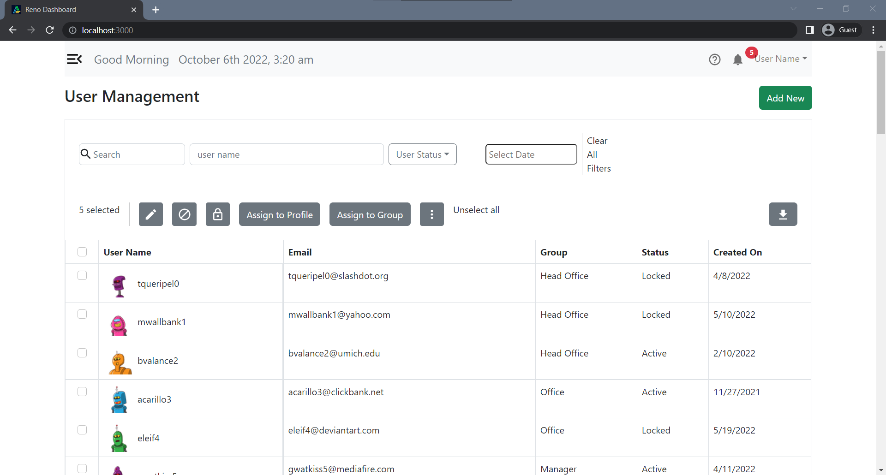
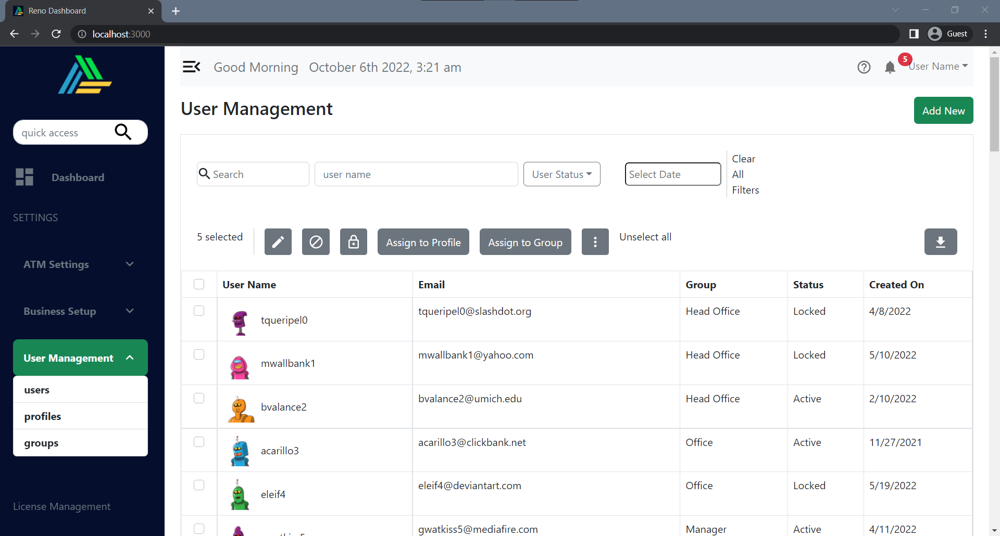
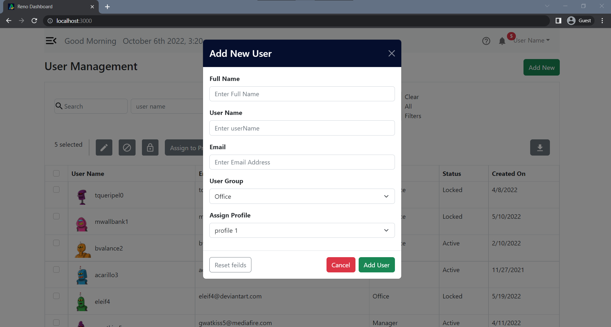
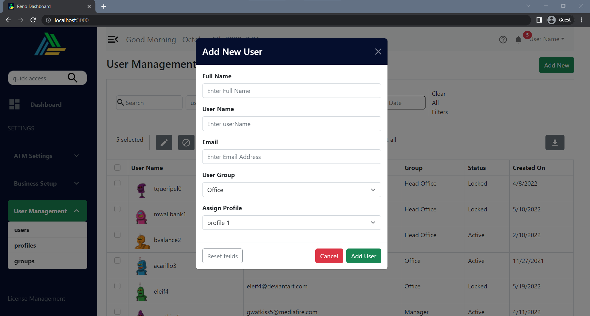
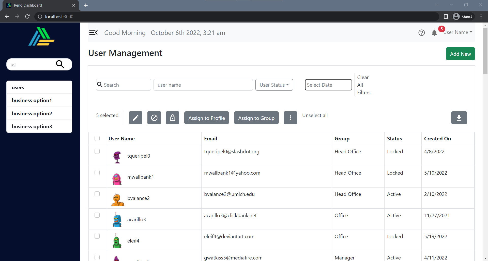
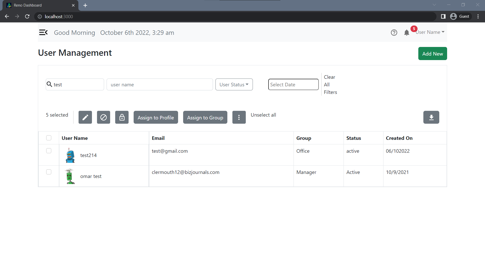
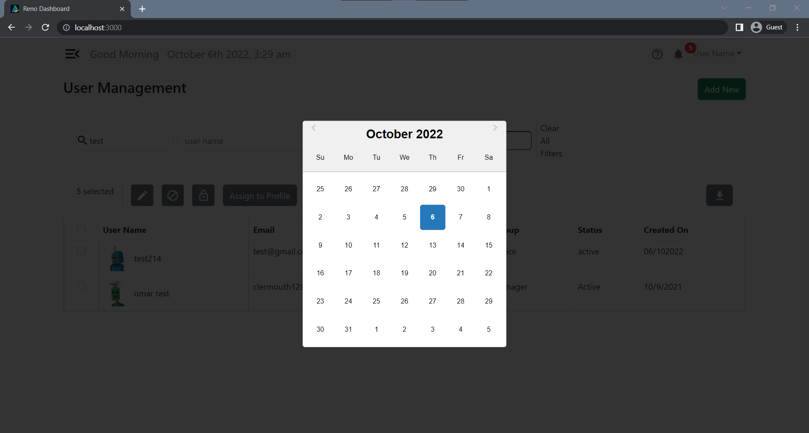
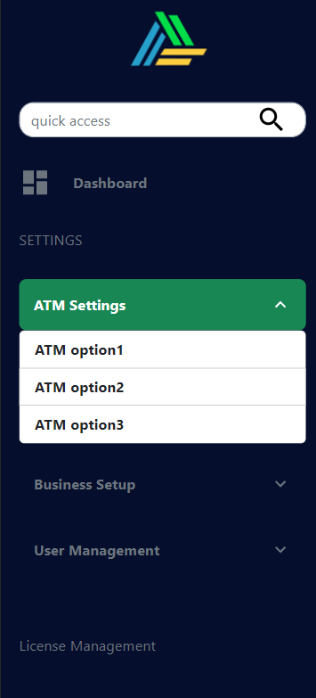
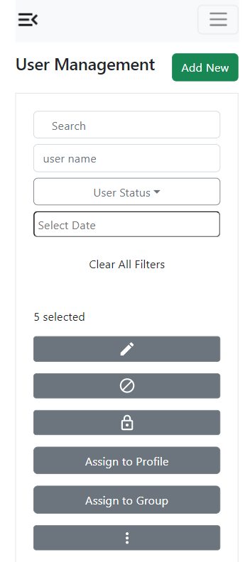
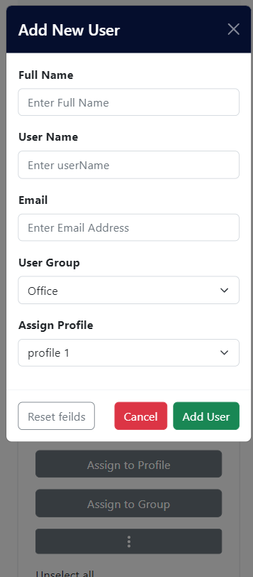

# Reno Dashboard

## 🚩About<a name = "about"></a>

dashboard to help admin control their system users & employees

it comes with strong search features to help save admin time

## 🏁Getting Started <a name = "start"></a>

1. **_Clone the repository_**

```bash
git clone https://github.com/omar214/Reno-Dashboard.git
```

2. **_Go to the directory of the repository_**

```bash
cd Reno-Dashboard
```

3. **_to run frontend_**

**add `.env` file like this inside Client**

```py
REACT_APP_API_URL = 'API URL'

```

**then run**

```bash
cd Client
npm install
npm start
```

**_now Client runs at port 3000_**

4.**_to run backend_**

```bash
cd Server
npm install
npm start
```

**_server runs at port 8080_**

## 🎥 Demo<a name = "demo"></a>

<div name = "demo" align="center" width=1189>
</div>

## 🎥 screenshots<a name = "screenshots"></a>

- collapesd sidebar
  

  <hr />

- expanded sidebar
  

  <hr />

- collapsed with modal
  

  <hr />

- expanded with modal
  

  <hr />

- sidebar search
  

  <hr />

- users search
  

  <hr />

- Date picker
  

  <hr />

**Responsive**

- Sidebar
  

  <hr />

- Users
  

  <hr />

- Add new User
  
